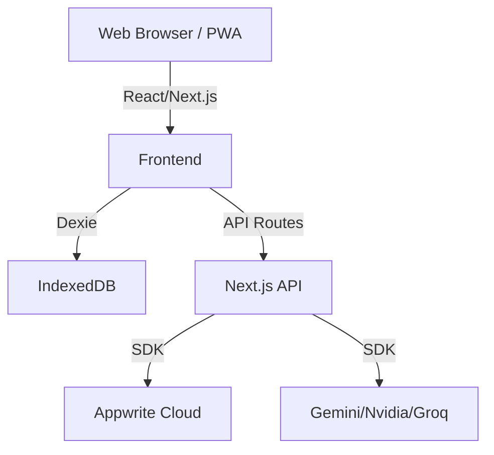

<!-- LAST_SYNC: 2026-05-23 -->
# System Design

## Overview & Goals
AI-powered South African Matric (Grade 12) exam preparation platform. Provides offline-capable, mobile-first study companion with AI-generated questions, past papers, and progress tracking.

## Architecture Diagram

## Data Flow
1. User requests content (Quiz/Exam).
2. System checks Dexie (Local Cache).
3. If missing, checks Appwrite.
4. If still missing, triggers AI Generation.
5. AI content is validated, saved to Appwrite and Dexie, then served to user.

## Tech Stack
- Next.js 16.2.6
- React 19.2.6
- TypeScript 6.0.3
- Tailwind CSS 4.3.0
- Appwrite (Auth, Database, Storage)
- Dexie (IndexedDB)
- AI: Gemini 2.0 Flash Lite, Nvidia NIM, Groq

## Key Abstractions
- **QuestionEngine**: Handles question lifecycle.
- **VisualEngine**: Handles diagram/image generation.
- **LearningOrchestrator**: Coordinates engines.
- **SyncQueue**: Manages offline-to-online data synchronization.

## External Integrations
- Appwrite Cloud
- Google Gemini API
- Nvidia NIM
- Groq Cloud
- UploadThing (File Uploads)
- Sentry (Error Tracking)

## Current Limitations & TODOs
- Social leaderboard depends on local storage primarily.
- Analytics comparative features need more global data.

## Recent Changes Log
- Mastery badge and avatar uploader components added.
- Study planner activation.
- Competency sync field fix.
