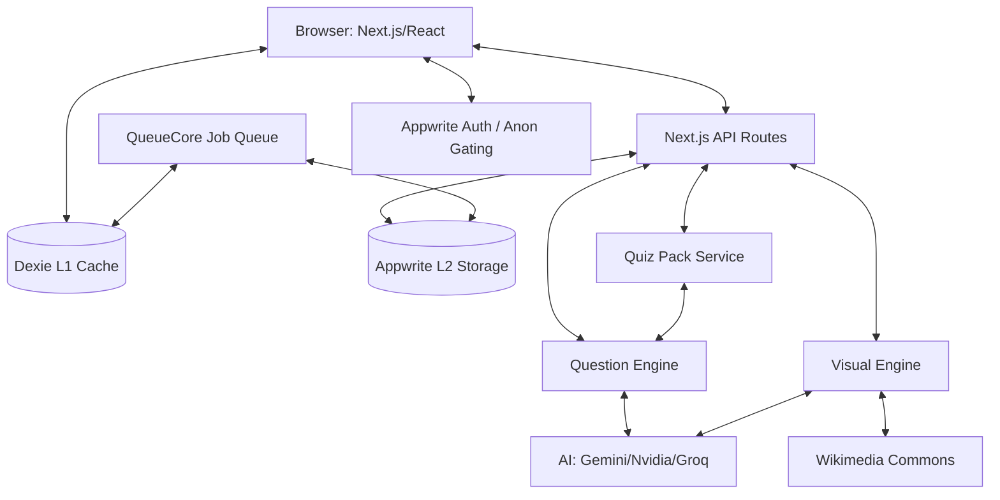

<!-- LAST_SYNC: 2026-05-29 -->
# System Design — Lumni

## Overview & Goals
Lumni is a mobile-first South African Matric exam prep platform. It provides offline-capable practice, AI-powered grading, and algorithmic study planning. The platform prioritizes offline availability through local AI generation (Quiz Packs), on-device caching (Dexie), and immersive focus modes.

## Architecture Diagram

## Data Flow
1. **Request Lifecycle**: User requests content. L1 (Dexie) is primary; L2 (Appwrite) is secondary; L3 (AI/Wiki) is fallback.
2. **Offline Practice**: `QuizPackService` handles bulk generation and storage in `quizPacks`/`packQuestions` Dexie tables for offline-first access.
3. **Question Processing**: Answer grading (local/AI) is orchestrated by `LearningOrchestrator`, which enqueues sync and progress jobs via `QueueCore`.
4. **Competency tracking**: Progress is assessed via `trackQuestionResult()`, updating the local `competency` table and syncing to Appwrite `competencies` collection.
5. **Exam Lifecycle**: `ExamDatesService` provides schedules from seed data/Dexie, with background sync to Appwrite for cross-device consistency.
6. **Immersive Focus**: `ImmersiveModeProvider` hides navigation elements during active quiz/exam sessions to maximize screen real estate and focus.

## Tech Stack
- **Frontend**: Next.js 16.2.6 (App Router), React 19.2.6, Tailwind CSS 4, Framer Motion 12.
- **Persistence**: Dexie 4 (IndexedDB, v23 schema), Appwrite Cloud, sql.js (SQLite).
- **AI/ML**: Gemini 2.0 Flash Lite (Primary), Nvidia NIM (Fallback), Groq Cloud (Last resort).
- **Visualization**: Konva (STEM diagrams), Mermaid.js, Recharts 3.
- **Verification**: Playwright (E2E), Storybook (UI), Bun (Tests).

## Key Abstractions
- **QuestionEngine**: Single source of truth for generation/grading/validation of 11 question types.
- **FlashcardEngine**: Unified SM-2/FSRS engine wrapping repository, limits, and recovery logic.
- **LearningOrchestrator**: Orchestrates engines and manages side effects (sync, analytics, jobs).
- **createRouteHandler**: Declarative factory for API routes with auth, Zod validation, and AI budgeting.
- **QueueCore**: Persistent Dexie-backed job queue for background tasks and offline mutation sync.
- **ImmersiveMode**: Context-driven UI state for hiding/showing core navigation components.

## External Integrations
- **Appwrite**: Authentication (Anonymous auto-upgrade), Database (10+ collections), Storage.
- **AI Providers**: Google Gemini, Nvidia NIM, Groq Cloud.
- **UploadThing**: Document and avatar storage.
- **Wikimedia**: Image search fallback for non-STEM visuals.

## Current Limitations & TODOs
- **OCR/Vision**: Future integration for national exam schedule extraction from image-based PDFs.
- **Comparative Stats**: Production path for multi-user data analysis still relies on estimates.
- **Mock Exam Mode**: Timed past-paper simulation feature currently in roadmap/development.
- **Component Coverage**: Expansion of Storybook stories and Playwright E2E coverage ongoing.
