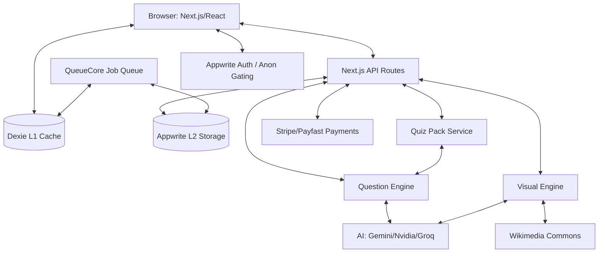

<!-- LAST_SYNC: 2026-06-01 -->
# System Design — Lumni

## Overview & Goals
Lumni is a mobile-first South African Matric exam prep platform. It provides offline-capable practice, AI-powered grading, and algorithmic study planning. The platform prioritizes offline availability through local AI generation (Quiz Packs), on-device caching (Dexie), and immersive focus modes.

## Architecture Diagram

## Data Flow
1. **Multi-Tier Caching**: User requests content. L1 (Dexie) is primary; L2 (Appwrite) is secondary; L3 (AI/Wiki) is fallback.
2. **Offline Practice**: `QuizPackService` enables bulk generation and storage in `quizPacks`/`packQuestions` Dexie tables for offline-first access.
3. **Question Processing**: Grading (local/AI) is orchestrated by `LearningOrchestrator`, which enqueues sync and progress jobs via `QueueCore`.
4. **Competency tracking**: Progress is assessed via `trackQuestionResult()`, updating the local `competency` table and syncing to Appwrite `competencies` collection.
5. **Monetization**: `PremiumProvider` gates features (offline packs, advanced analytics) based on Appwrite `premium_subscriptions`.
6. **B2B2C Flows**: Teachers manage assignments via `teacher_assignments`; parents monitor progress via `ParentShell`.
7. **Observability**: `latency-tracker` monitors AI performance; `events.ts` tracks usage events.

## Tech Stack
- **Frontend**: Next.js 16.2.6, React 19.2.6, Tailwind CSS 4, Framer Motion 12.
- **Persistence**: Dexie 4 (IndexedDB, v23 schema), Appwrite Cloud, sql.js (SQLite).
- **AI/ML**: Gemini 2.0 Flash Lite (Primary), Nvidia NIM (Fallback), Groq Cloud (Last resort).
- **Visualization**: Konva (STEM diagrams), Mermaid.js, Recharts 3.
- **Verification**: Playwright (E2E), Storybook (UI), Bun (Tests).

## Key Abstractions
- **QuestionEngine**: Single source of truth for generation/grading/validation of 11 question types.
- **FlashcardEngine**: Unified SM-2/FSRS engine wrapping repository, limits, and recovery logic.
- **LearningOrchestrator**: Orchestrates engines and manages side effects (sync, analytics, jobs).
- **createRouteHandler**: Declarative factory for API routes with auth and Zod validation.
- **ImmersiveMode**: Context-driven UI state for focus (auto-hides nav bars).
- **SwipeableCardDeck**: Tinder-style interaction for spaced-repetition flashcards.

## External Integrations
- **Appwrite**: Authentication, Database, Storage.
- **AI Providers**: Google Gemini, Nvidia NIM, Groq Cloud.
- **Payments**: Stripe, Payfast.
- **UploadThing**: Document and avatar storage.

## Current Limitations & TODOs
- **Mock exam mode**: Past-paper simulation is still in development.
- **OCR text extraction**: Official PDF timetables require OCR for automated ingestion.
- **Comparative analytics**: Scaling depends on cross-user data aggregation in Appwrite.
- **Rate limiting**: Current implementation is in-memory; requires Redis for multi-instance.

## Recent Changes Log (Last 7 Days)
- Initialized Context Layer with 6-file protocol.
- Deployed Swipeable Card Deck for flashcards.
- Activated Full-Screen Immersive Mode for active sessions.
- Consolidated Spaced Repetition logic.
