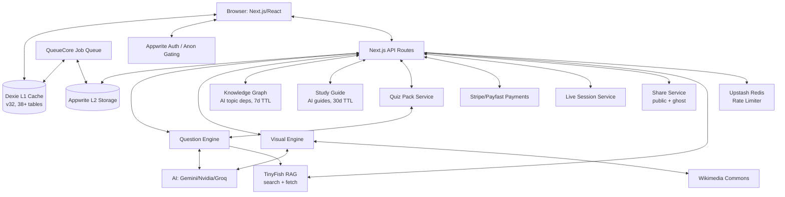

<!-- LAST_SYNC: 2026-06-07 -->
# System Design — Lumni

## Overview & Goals
Lumni is a mobile-first South African Matric exam prep platform. It provides offline-capable practice, AI-powered grading, algorithmic study planning, and web-grounded RAG injection for both solve and quiz generation (via TinyFish). The platform prioritizes offline availability through local AI generation (Quiz Packs), on-device caching (Dexie), and immersive focus modes.

## Architecture Diagram

## Data Flow
1. **Multi-Tier Caching**: User requests content. L1 (Dexie) is primary; L2 (Appwrite) is secondary; L3 (AI/Wiki/TinyFish) is fallback. All DB access via `DataAccess` interface.
2. **Web-Grounded AI (RAG)**: `/api/solve` and `/api/engine/generate` call `src/lib/tinyfish/` to inject live CAPS/DBE sources into the AI prompt. Cached for 14d (quiz) or 24h (solve). In-flight dedup + 3s timeout fail-open. 24-subject allowlist + per-user daily cap.
3. **Offline Practice**: `QuizPackService` enables bulk generation and storage in `quizPacks`/`packQuestions` Dexie tables for offline-first access.
4. **Question Processing**: Grading (local/AI) is orchestrated by `LearningOrchestrator`, which enqueues sync and progress jobs via `QueueCore`. Source attribution via `source-mapper.ts`.
5. **Competency tracking**: Progress is assessed via `trackQuestionResult()`, updating the local `competency` table and syncing to Appwrite `competencies` collection. Per-paper (P1/P2) split supported.
6. **Knowledge Graph**: AI generates topic dependency graphs (prerequisites/core/advanced). Cached 7d in Dexie v29. Two UIs: `LearningMapCard` (dashboard) + `TopicGraph` (per-question).
7. **Study Guides**: AI generates structured guides with sections + summary. Cached 30d in Dexie v32. `/study-guide` page with subject/topic input.
8. **Live Sessions**: Real-time collaborative study sessions via Appwrite. `useLiveSession()` hook with 15s polling.
9. **Monetization**: `PremiumProvider` gates features (offline packs, advanced analytics) based on Appwrite `premium_subscriptions`.
10. **B2B2C Flows**: Teachers manage assignments via `teacher_assignments`; parents monitor progress via `ParentShell`. Ghost links for anonymous B2B2C access.
11. **Observability**: `latency-tracker` monitors AI performance; `events.ts` tracks usage events. Centralized `logger.ts` with Sentry production integration.
12. **Retention Loop**: Wrong-answer re-encounter via `retentionRecurrence` table. Auto-insert 3 wrong answers into next eligible quiz. Next-best-action dashboard card.

## Tech Stack
- **Frontend**: Next.js 16.2.7, React 19.2.7, Tailwind CSS 4, Framer Motion 12.
- **Persistence**: Dexie 4 (IndexedDB, v32 schema — 38+ tables), Appwrite Cloud, sql.js (SQLite).
- **AI/ML**: Gemini 2.0 Flash Lite (Primary), Nvidia NIM (Fallback), Groq Cloud (Last resort). TinyFish (RAG) for web-grounded solve + quiz. Uniform AI adapter for pluggable provider normalizers.
- **Visualization**: Konva (STEM diagrams), Mermaid.js, Recharts 3.
- **Rate Limiting**: MapStore (in-memory) + RedisStore (Upstash Redis for production).
- **Verification**: Playwright (E2E + visual tests), Storybook (UI, 10 stories), Bun (1225 tests), Knip (dead code detection).
- **Monitoring**: Sentry (error tracking), centralized logger, observability events.

## Key Abstractions
- **QuestionEngine**: Single source of truth for generation/grading/validation of 11 question types. RAG-augmented via `PromptManager`.
- **FlashcardEngine**: Unified SM-2/FSRS engine wrapping DataAccess, limits, and recovery logic.
- **DataAccess**: Typed interface over all 38+ Dexie tables. `DexieDataAccess` (production) + `InMemoryDataAccess` (tests with `seed()`).
- **LearningOrchestrator**: Orchestrates engines and manages side effects (sync, analytics, jobs).
- **TinyFish RAG**: 7 modules — client, cache (Dexie 14d), in-flight dedup, 24-subject allowlist, XML wrap + prompt framing, types, index barrel.
- **KnowledgeGraph**: AI-generated topic dependency graphs with 7d cache.
- **StudyGuide**: AI-generated structured study guides with 30d cache.
- **LiveSessionService**: Appwrite-backed real-time study sessions with 15s polling.
- **UniformAIAdapter**: Factory for pluggable AI provider normalizers (`openaiNormalizer`, `geminiNormalizer`).
- **ShareService**: Public share links, ghost links, assignment sharing.
- **createRouteHandler**: Declarative factory for API routes with auth and Zod validation.
- **ImmersiveMode**: Context-driven UI state for focus (auto-hides nav bars).
- **SwipeableCardDeck**: Tinder-style interaction for spaced-repetition flashcards.
- **CachingStrategy**: Generic multi-tier caching framework.

## External Integrations
- **Appwrite**: Authentication, Database, Storage, Live Sessions.
- **AI Providers**: Google Gemini, Nvidia NIM, Groq Cloud.
- **RAG**: TinyFish (search + fetch, free tier, consent-gated).
- **Payments**: Stripe, Payfast.
- **UploadThing**: Document and avatar storage.
- **Upstash Redis**: Production rate limiting.
- **Sentry**: Error tracking (client + server + edge).

## Current Limitations & TODOs
- **OCR text extraction**: Official PDF timetables require OCR for automated ingestion.
- **Comparative analytics**: Scaling depends on cross-user data aggregation in Appwrite.
- **PWA titlebar theming**: Gap 3 of Theme Chrome Takeover not yet implemented.
- **Keyboard-accessible flashcard deck**: Full ARIA widget semantics not yet complete.

## Recent Changes Log (Last 7 Days)
- **Data Consolidation Phase 1-4**: DataAccess seam expanded to all 38+ tables. AnalyticsEngine, QuizPackService, RetentionService, 20+ files migrated. localStorage → Dexie migration (v31).
- **Knowledge Graph**: `src/lib/knowledge-graph/` — AI topic dependency graphs, 7d cache (Dexie v29). `LearningMapCard` + `TopicGraph` UIs.
- **Study Guide Generator**: `src/lib/study-guide/` — AI structured guides, 30d cache (Dexie v32). `/study-guide` page.
- **Live Study Sessions**: Appwrite-backed with `useLiveSession()` (15s polling). `LiveSessionService`.
- **Batch 5**: Public share route (`/q/[id]`), PWA offline polish, calendar view in study planner.
- **Batch 6 Hardening**: i18n round 2, knip setup, Playwright visual tests, storybook 2→10 stories, a11y round 2.
- **Theme Chrome Takeover**: Dynamic `theme-color` sync, accent-tinted nav glass, SSR viewport.
- **Navigation Sidebar**: Categorized sidebar with search; removed PageTransition + loading.tsx files.
- **Daily Bolt Simplification**: Removed two-step; `BoltCelebration` with 800ms auto-advance.
- **Uniform AI Adapter**: `createUniformProvider()` factory with pluggable normalizers.
- **Redis Rate Limiter**: `RedisStore` via `@upstash/redis` for production multi-instance.
- **Wrong-answer re-encounter loop**: `retentionRecurrence` table; next-best-action dashboard card.
- **Quiz engine library**: `src/lib/quiz/` — `useQuiz()` hook with auto-flashcard creation.
- **Caching strategy module**: Generic multi-tier cache framework.
- **Flashcard deck types**: `FlashcardDeckCard`, `FlashcardDeck` interfaces.
- **Search-in-chunks**: Parallel Dexie search with relevance scoring.
