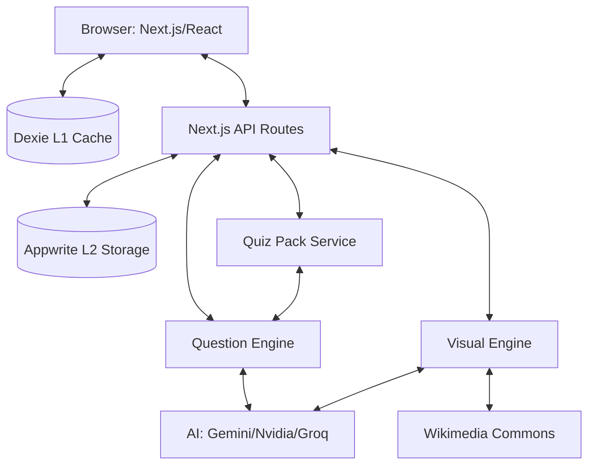

<!-- LAST_SYNC: 2026-05-28 -->
# System Design — Lumni

## Overview & Goals
Lumni is a mobile-first South African Matric exam prep platform. It provides offline-capable practice, AI-powered grading, and algorithmic study planning to help students improve their results. The platform prioritizes offline availability through local AI generation and on-device caching.

## Architecture Diagram

## Data Flow
1. **Practice Request**: User requests questions for a subject. L1 (Dexie) is checked first, then L2 (Appwrite), then L3 (AI Generation).
2. **Offline Download**: User selects "Download for Offline" for a topic. `QuizPackService` enqueues a bulk generation job. Questions and visuals are stored in Dexie `packQuestions` table.
3. **Question Processing**: User answers are graded locally (for 4 types) or via AI (7 types). `LearningOrchestrator` handles side effects.
4. **Competency Tracking**: Results update the local `competency` table and are queued for Appwrite sync via `QueueCore`.
5. **Exam Tracking**: `ExamDatesService` provides national exam schedules, pulling from Dexie or Seed data, with background sync to Appwrite to maintain global availability.

## Tech Stack
- **Frontend**: Next.js 16.2.6, React 19.2.6, Tailwind CSS 4, Framer Motion, Zustand.
- **Persistence**: Dexie.js (IndexedDB), Appwrite Database, sql.js (SQLite).
- **AI/ML**: Gemini 2.0 Flash Lite (Primary), Nvidia NIM (Fallback), Groq (Fallback).
- **Visualization**: Konva (Canvas diagrams), Mermaid.js, Recharts.
- **Verification**: Playwright (E2E), Storybook (UI Documentation), Bun (Tests).
- **Monitoring**: Sentry (Client/Server/Edge).

## Key Abstractions
- **QuestionEngine**: Single source of truth for generation, grading, and validation across 11 question types.
- **VisualEngine**: Manages generation and retrieval of educational visuals (STEM diagrams vs. Wikimedia images).
- **FlashcardEngine**: Unified engine wrapping repository + SM-2/FSRS + daily limits.
- **LearningOrchestrator**: Coordinates engines and manages background job side effects (sync, analytics).
- **QuizPackService**: Manages the lifecycle of AI-generated offline question sets.
- **createRouteHandler**: Generic factory for declarative API route handlers with auth, validation, and budget tracking.
- **QueueCore**: Persistent job queue ensuring offline mutations and orchestration tasks are eventually executed.

## External Integrations
- **Appwrite**: Auth, Database (exam_sessions, questions, visuals, exam_dates), Storage.
- **AI Providers**: Google Gemini, Nvidia NIM, Groq Cloud.
- **UploadThing**: File uploads for avatars and documents.
- **Wikimedia**: Image search for non-STEM visuals.

## Current Limitations & TODOs
- **OCR**: National exam schedule extraction currently manual; needs OCR/AI vision for image-based PDFs.
- **Comparative Analytics**: Currently uses estimates due to Appwrite data privacy constraints.
- **Mock Exam Mode**: Planned feature for timed past-paper simulations.
- **Component Coverage**: Ongoing expansion of Storybook and Playwright test suites.
