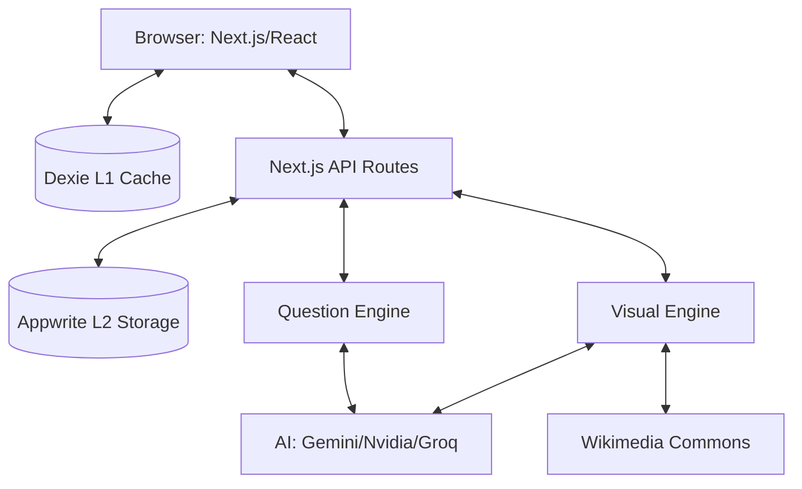

<!-- LAST_SYNC: 2026-05-25 -->
# System Design — Lumni

## Overview & Goals
Lumni is a mobile-first South African Matric exam prep platform. It provides offline-capable practice, AI-powered grading, and algorithmic study planning to help students improve their results.

## Architecture Diagram

## Data Flow
1. **Request**: User requests practice questions for a subject.
2. **L1 Check**: App checks Dexie for cached questions.
3. **L2 Check**: If not in L1, API checks Appwrite questions collection.
4. **Generation**: If not in L2, `QuestionEngine` triggers AI generation.
5. **Enrichment**: `VisualEngine` generates diagrams (STEM) or searches images (non-STEM) in the background.
6. **Processing**: User answers questions; `LearningOrchestrator` handles grading and enriches user competency data.
7. **Sync**: Results are saved to Dexie and queued for background sync to Appwrite via `QueueCore`.

## Tech Stack
- **Frontend**: Next.js 16.2.6, React 19.2.6, Tailwind CSS 4, Framer Motion, Zustand.
- **Persistence**: Dexie.js (IndexedDB), Appwrite Database, sql.js (SQLite).
- **AI/ML**: Gemini 2.0 Flash Lite (Primary), Nvidia NIM (Fallback), Groq (Fallback).
- **Visualization**: Konva (Canvas diagrams), Mermaid.js, Recharts.
- **Monitoring**: Sentry (Client/Server/Edge).

## Key Abstractions
- **QuestionEngine**: Single source of truth for generation, grading, and validation across 11 question types.
- **VisualEngine**: Manages generation and retrieval of educational visuals.
- **FlashcardEngine**: Unified engine wrapping repository + SM-2/FSRS + daily limits.
- **LearningOrchestrator**: Coordinates engines and manages background job side effects.
- **createRouteHandler**: Generic factory for declarative API route handlers with auth and Zod validation.
- **Services Barrel**: Unified access to all 10 domain services with `ServiceResult<T>` handling.
- **QueueCore**: Persistent job queue ensuring offline mutations and orchestration tasks are eventually executed.

## External Integrations
- **Appwrite**: Auth, Database, Storage.
- **AI Providers**: Google Gemini, Nvidia NIM, Groq Cloud.
- **UploadThing**: File uploads for avatars and documents.
- **Wikimedia**: Image search for non-STEM visuals.

## Current Limitations & TODOs
- **OCR**: National exam schedule extraction currently manual; needs OCR/AI vision for image-based PDFs.
- **Tests**: High priority for E2E (Playwright) and component test coverage.
- **Analytics**: Comparative analytics currently use estimates due to Appwrite data privacy constraints.
- **Exam Dates**: Need server-side sync path for exam date data.
