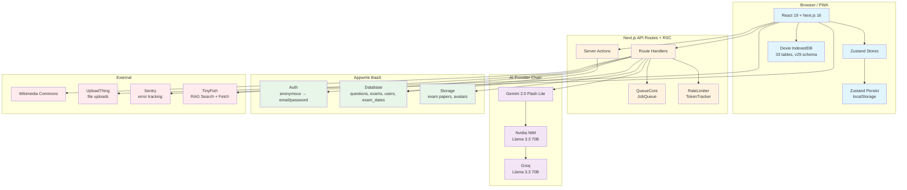
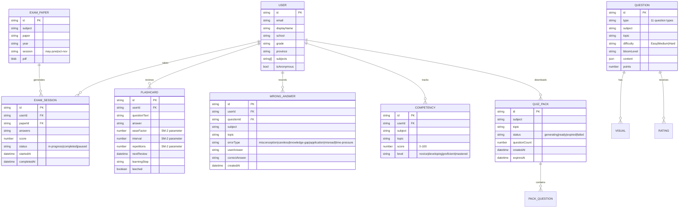

# System Design — Lumni

**Generated:** 2026-05-29  
**Last synced:** 2026-06-02 (sessions 1-19, June 2026)

---

## Overview

Lumni is a mobile-first, offline-capable SA Matric exam preparation platform. It generates AI-powered questions with visuals, tracks student competency across subjects, and schedules personalized study plans — all while supporting anonymous-to-authenticated progression and free-tier budget constraints. The system uses a 3-tier caching architecture (Dexie → Appwrite → AI/Wikimedia) to minimize API costs and enable offline use.

---

## High-Level Architecture



---

## Data Model



---

## Component Dictionary

### Client Layer

| Module | Responsibility | Tech | Key File(s) |
|--------|---------------|------|-------------|
| **Dashboard** | Landing page: stats, study plan, quick actions, search, analytics, offline packs | React, recharts | `src/components/dashboard/` |
| **Quiz** | Question display, answer capture, timer, feedback, diagrams, immersive mode | React, Konva, Framer Motion | `src/components/quiz/` |
| **Exam** | Past paper viewer, session management, results & review, immersive mode | React, sql.js, react-pdf | `src/components/exam/` |
| **Flashcards** | SM-2 spaced repetition, Tinder-style swipeable deck, auto-generation | React, Dexie, Framer Motion | `src/components/flashcard/` |
| **Study Planner** | Algorithmic scheduling, weekly overview | React, localStorage | `src/components/study-planner/` |
| **Onboarding** | 5-step wizard with Three.js particles, push notification opt-in | React, Three.js, Framer Motion | `src/components/onboarding/` |
| **Auth** | Sign-in/sign-up, magic link, anonymous upgrade | React, Appwrite SDK | `src/components/auth/` |
| **Settings** | Profile, privacy (GDPR consent toggles), data management, theme | React | `src/components/settings/` |
| **Consent** | Cookie banner, TOS banner, consent gate, parental consent UI | React, Dexie + Appwrite | `src/components/consent/` |
| **Visual** | Diagram/image rendering for questions | Konva, Mermaid, Wikimedia | `src/components/visual/` |
| **Immersive** | Full-screen mode provider, exit button, nav auto-hiding | React Context | `src/components/shared/immersive-mode.tsx` |
| **Tools** | Domain-organized: core, communication, math, science, scheduling | React | `src/components/tools/` |

### State Layer

| Store | Responsibility | Tech | Location |
|-------|---------------|------|----------|
| Zustand (multiple) | Quiz session, exam session, sync queue, search, notifications, bookmarks, voice recorder, premium | Zustand | `src/store/` |
| Dexie | Offline cache: questions, visuals, exam dates, ratings, flashcard SM-2, quiz packs, jobs, sync queue, competencies, wrong answers, chat, userConsents | Dexie + dexie-react-hooks | `src/lib/db/` |
| React Query | Server state: API data caching, background refetch | TanStack React Query | `src/lib/query-client.ts` |

### Server / API Layer

| Module | Responsibility | Tech | Location |
|--------|---------------|------|----------|
| **API Route Handlers** | ~41 route groups: engine, auth, exams, admin, sync, quiz-packs | Next.js App Router + createRouteHandler | `src/app/api/` |
| **createRouteHandler** | Generic factory: auto auth guard, body parse, Zod validation, error wrap | TypeScript | `src/lib/api/create-route-handler.ts` |
| **Server Actions** | Exam paper actions, quiz actions | Next.js Server Actions | `src/lib/server/` |
| **RateLimiter** | Auth rate limits (3 sign-in/5min, 1 magic link/5min) | In-memory Map | `src/lib/rate-limiter/` |
| **TokenTracker** | AI budget: per-user + global caps | In-memory counter | `src/lib/ai/token-tracker.ts` |
| **QueueCore** | Background job processing with retry | Dexie-backed | `src/lib/queue/core.ts` |
| **Sentry** | Error tracking (client + server + edge) | @sentry/nextjs | `sentry.*.config.ts` |

### Business Logic Layer

| Module | Responsibility | Tech | Location |
|--------|---------------|------|----------|
| **QuestionEngine** | AI question generation, grading, hinting, validation | 11-type processor pipeline; RAG-augmented via PromptManager | `src/lib/question-engine/` |
| **VisualEngine** | AI diagram generation (Konva) + Wikimedia search | STEM vs non-STEM routing | `src/lib/visual-engine/` |
| **TinyFish RAG** | Web-grounded reference material for solve + quiz generation | searchWithRAG (3-source, 14d cache) + getSourceForQuestion (1-source, 24h cache); 24-subject allowlist; per-user daily limit; 3s timeout fail-open; XML wrap + prompt framing | `src/lib/tinyfish/` |
| **FlashcardEngine** | Unified SR: SM-2/FSRS + daily limits + learning steps + ease-hell + leech + settings | Dexie-backed | `src/lib/flashcard-engine/` |
| **CompetencyEngine** | Bloom's taxonomy scoring, PathEngine routing | Score→Level mapping | `src/lib/competency-engine/` |
| **LearningOrchestrator** | Orchestrates generate+grade+queue side effects | Composes QuestionEngine | `src/lib/orchestrator/` |
| **QuizPackService** | Offline AI quiz pack lifecycle (generate, persist, expire) | Dexie + QuestionEngine | `src/lib/quiz-packs/` |
| **Services Barrel** | All 12 services (analytics, competency, progress, flashcard, notification, consent, etc.) | ServiceResult<T> | `src/lib/services/` |
| **StudyPlannerService** | Inverse-competency-weighted scheduling | Round-robin algorithm | `src/lib/study-planner/` |
| **SyncService** | Offline-to-online data reconciliation | Dexie→Appwrite flush | `src/lib/sync/` |
| **AuthService** | Anonymous→authenticated upgrade, magic link | Appwrite SDK | `src/lib/auth/` |
| **PremiumService** | Premium gating, checkout, verification | localStorage + API | `src/lib/premium/` |
| **UserConsentService** | GDPR/POPIA dual-write consent (Dexie + Appwrite) | Background job queue | `src/lib/services/user-consent-service.ts` |
| **i18n** | Locale-based routing ([locale] prefix), en/af/zu translations | Next.js middleware | `src/i18n/` |

### Backend (External)

| Service | Responsibility | Free Tier Limit |
|---------|---------------|-----------------|
| **Appwrite** | Auth, DB (questions, users, sessions, exam_dates), storage (exam PDFs, avatars) | 50k docs, 10GB storage |
| **Gemini 2.0 Flash Lite** | Primary AI: question gen, grading, visuals | 60 req/min |
| **Nvidia NIM** | Fallback AI: Llama 3.3 70B | Pay-as-you-go |
| **Groq** | Last-resort AI: Llama 3.3 70B | 30 req/min |
| **UploadThing** | File upload infrastructure | 2GB free |
| **Sentry** | Error tracking (DSN configured) | 5k events/month |
| **TinyFish** | Web search + fetch for RAG injection into solve + quiz | Free tier (no credit card) |

---

## Interfaces (Key APIs)

### Public API Routes

| Route | Method | Purpose | Handler Style |
|-------|--------|---------|---------------|
| `/api/engine/generate` | POST | Generate questions (subject, topic, count, type, difficulty) | Engine handler |
| `/api/engine/grade` | POST | Grade a question answer | Engine handler |
| `/api/engine/hint` | POST | Get a hint for a question | Engine handler |
| `/api/engine/visual` | POST | Generate diagram/visual for a question | Engine handler |
| `/api/engine/test` | GET | Health check | Engine handler |
| `/api/engine/budget` | GET | Get current token budget status | Engine handler |
| `/api/engine/next-topics` | POST | Get next recommended topics based on competency | Engine handler |
| `/api/engine/study-plan` | POST | Generate study plan | Engine handler |
| `/api/quiz-packs/generate` | POST | Generate offline AI quiz pack | Rate-limited |
| `/api/auth/verify` | POST | Verify sign-in session | Engine handler |
| `/api/auth/rate-limit` | GET | Check auth rate limit status | Engine handler |
| `/api/exam-sessions` | GET/POST | List / create exam sessions | `createRouteHandler` |
| `/api/exam-sessions/[id]` | GET/PUT | Get / update exam session | Traditional |
| `/api/analytics/comparative` | GET | Cross-user comparative analytics | `createRouteHandler` |
| `/api/analytics/trends` | GET | User analytics trends | `createRouteHandler` |
| `/api/admin/exams` | GET | Admin exam list | `createRouteHandler` |
| `/api/jobs/process` | POST | Process background job batch | `createRouteHandler` |
| `/api/sync` | POST | Flush offline mutation queue | Traditional |
| `/api/premium/checkout` | POST | Create premium checkout session | Traditional |
| `/api/leaderboard` | GET | Get social leaderboard | Traditional |
| `/api/push/subscribe` | POST | Subscribe to push notifications | Traditional |

### Key Event Flows

**Question Generation (orchestrated, RAG-grounded):**
```
Client -> POST /api/engine/generate
  -> LearningOrchestrator.generateQuestionSet()
    -> QuestionEngine.generateInternal()
      -> fetchRagContext(subject, topic, userId)  [TinyFish, 3s timeout, once per batch]
        -> tinyfishCache hit OR searchWithRAG (24-subject allowlist, per-user daily cap)
        -> buildRagContext(sources) -> { sources, xml, domainsQueried }
      -> PromptManager.getPrompt(type, params, ragContext)
        -> User prompt: prepend <reference_material> XML
        -> System prompt: append buildPromptInstruction() framing
    -> QuestionProcessor.generate(params, ragContext) [AI call via Gemini->Nvidia->Groq]
    -> Validator: per-type validation (score 0-100)
    -> Cache: Dexie L1 + Appwrite L2
    -> VisualEngine: background pre-cache for each question
    -> Analytics: enqueue analytics-sync job
    -> Response: Question[]
```

**Quiz Answer + Grade:**
```
Client -> POST /api/engine/grade
  -> LearningOrchestrator.gradeAndTrack()
    -> QuestionEngine.grade() [local for 4 types, AI for 7]
    -> trackQuestionResult()
      -> CompetencyEngine: update score + bloom level
      -> WrongAnswerJournal: save if incorrect
      -> Flashcards: SM-2 review (existing) or create (new)
      -> Analytics: enqueue analytics-sync job
    -> Response: GradingResult
```

**Offline Quiz Pack Generation:**
```
Client -> POST /api/quiz-packs/generate
  -> QuizPackService.generate()
    -> Rate limiter check
    -> QuestionEngine.generate() × count
    -> Dexie: quizPacks + packQuestions tables
    -> Response: QuizPack { id, subject, status: "generating" }
  -> Background: QuestionEngine finishes -> status: "ready"
```

### Database Collections (Appwrite)

| Collection | Purpose | Documents |
|------------|---------|-----------|
| `users` | User profiles + auth | Auth-managed |
| `questions` | Cached AI-generated questions | ~10k (cleaned >30d) |
| `visuals` | Cached AI-generated diagrams | ~5k (cleaned >30d) |
| `exam_sessions` | In-progress + completed exam sessions | Per-user |
| `exam_papers` | Uploaded past exam PDFs | ~500 |
| `exam_dates` | National exam timetable (synced server-side) | ~200 |
| `user_consents` | GDPR/POPIA consent preferences (dual-write) | Per-user |
| `teacher_assignments` | Teacher-assigned student work (FEAT-02) | Per-teacher |
| `teacher_students` | Teacher-student linking (FEAT-01/02) | Per-teacher |
| `premium_subscriptions` | Premium subscription records (Stripe webhook) | Per-user |
| `study_groups` | Study group metadata + membership (v3) | Per-group |

### Database Tables (Dexie / IndexedDB) — v25 Schema

| Table | Purpose | Expiry |
|-------|---------|--------|
| `questions` | Cached generated questions | 24h |
| `visuals` | Cached generated diagrams | 7d |
| `examDates` | Exam timetable slots | 7d |
| `questionRatings` | User star ratings on questions | Permanent |
| `wrongAnswers` | Wrong answer journal | Permanent |
| `flashcards` | SM-2 spaced repetition state (includes learningStep, leeched fields) | Permanent |
| `srsettings` | SR settings persisted via flashcard-engine | Permanent |
| `quizPacks` | Offline AI quiz pack manifests | 30d |
| `packQuestions` | Questions within offline packs | 30d |
| `jobs` | Background job queue (QueueCore) | Processed → deleted |
| `syncQueue` | Offline mutation queue | Flushed → deleted |
| `competencies` | Per-topic competency scores | Permanent |
| `chatMessages` | AI chat history | Permanent |
| `notes` | User notes | Permanent |
| `userConsents` | GDPR/POPIA consent preferences (dual-write to Appwrite) | Permanent |
| `studySessions` | Study planner sessions | Permanent |
| `tinyfishCache` | TinyFish RAG cache (key, value, expiresAt, fetchedAt) | 14d |
| `tinyfishUsage` | Per-user TinyFish daily usage count | Permanent |
| +15 others | Exam sessions, progress, conflicts, subjects, bookmarks, sync queue, etc. | Varies |

---

## Non-Functional Requirements

| Area | Target | Implementation |
|------|--------|----------------|
| **Offline support** | Full read access, queued writes | Dexie + SyncQueue + offline quiz packs |
| **AI budget** | 2000 calls/day global, per-user caps | TokenTracker + 429 responses |
| **Auth security** | 3 attempts/5min sign-in, 1/5min magic link | In-memory rate limiter |
| **Cache freshness** | Questions: 24h, Visuals: 7d, QuizPacks: 30d | Dexie TTL + Appwrite cleanup cron |
| **Appwrite limits** | <50k documents | Cleanup cron deletes >30d |
| **Page load** | Mobile-first, Core Web Vitals tracked | Sentry + web-vitals |
| **Error monitoring** | Client + server + edge | Sentry DSN configured |
| **Build quality** | Zero tsc errors, zero Biome errors | Pre-commit hook (Bun) |
| **E2E coverage** | Smoke tests for core flows | Playwright 1.60.0 |
| **UI documentation** | Storybook for component library | Storybook 10.4.1 |

### Scalability Bottlenecks

- **AI provider chain**: Sequential fallback (Gemini → Nvidia → Groq) adds latency when primary fails
- **RateLimiter**: In-memory — does not survive server restart (no Redis)
- **Appwrite 50k doc limit**: Cleanup cron mitigates but doesn't scale past free tier
- **SyncQueue**: Sequential flush per user — large queues may timeout
- **Comparative analytics**: Falls back to estimates without other users' data in Appwrite

### Security Boundaries

| Boundary | Enforcement |
|----------|-------------|
| API routes → Appwrite DB | Server-side API key (not exposed to client) |
| Anonymous → authenticated | `updateEmail()` preserves same userId — no data leak |
| Admin routes | Separate magic-link + OTP auth (localStorage session) |
| File uploads | UploadThing server-side verification |
| Push notifications | VAPID key, subscription-based (web-push) |

---

## Evolution Roadmap

| Priority | Change | Rationale | Status |
|----------|--------|-----------|--------|
| P1 | Appwrite write path for exam_dates + server-side cron scraping | Productionize exam dates (was seed-only + Dexie) | ✅ Done |
| P1 | E2E tests (Playwright) | Coverage gap: only unit tests existed | ✅ Done |
| P1 | Offline AI Quiz Packs | Downloadable packs for load-shedding resilience | ✅ Done |
| P1 | Storybook setup | UI component documentation | ✅ Done |
| P1 | Swipeable flashcard deck | Tinder-style drag-to-swipe + keyboard support | ✅ Done |
| P1 | Full-screen immersive mode | Distraction-free quiz/exam (auto nav-hiding) | ✅ Done |
| P1 | Mega-component decomposition | 4 components split (2016→1136 lines, −44%) | ✅ Done |
| P1 | Bun migration | Runtime + CI + Husky migration to Bun | ✅ Done |
| P1 | Observability dashboard | AI latency tracking + usage events + admin panel | ✅ Done |
| P1 | Teacher + Parent dashboards | Role-gated B2B2C analytics (FEAT-01, FEAT-02) | ✅ Done |
| P1 | Premium gating + Stripe webhook | Monetization end-to-end: checkout, verify, cancel | ✅ Done |
| P1 | GDPR/POPIA consent suite | Cookie banner, TOS versioning, account deletion, data export | ✅ Done |
| P1 | i18n AF + ZU | Afrikaans 100%, isiZulu ~97% complete | ✅ Done |
| P1 | WCAG 2.2 AA a11y audit + critical fixes | 30+ components audited, 11 critical + 8 high fixes | ✅ Done |
| P1 | Web-grounded AI — TinyFish RAG (foundation + solve + quiz) | 3 PRs: `f5313f32` foundation (7 modules + Dexie v25), `6c7c2ff1` solve (DI + VerifiedByPill), `dd3940c4` quiz (PromptManager + rag-enricher + 3s timeout) | ✅ Done |
| P2 | Per-question source persistence on `Question` type | Currently batch-level only via `lastRagContext`; need `Question.sources?: WebSource[]` for per-question attribution | Planned |
| P2 | VerifiedByPill on quiz results page | Solve-only today; data available via `QuestionEngine.getLastRagContext()` but no UI consumer | Planned |
| P2 | Redis-backed RateLimiter + TokenTracker | Survives server restarts, shared across instances | Planned |
| P2 | Keyboard-accessible flashcard deck | Full redesign for keyboard-only operation | Planned |

---

## Deployment

```mermaid
graph LR
    A[Vercel Edge/Serverless] --> B[Next.js API Routes]
    A --> C[Next.js SSR/RSC Pages]
    A --> D[Next.js Static Assets]
    A --> E[Sentry Monitoring]
    
    B --> F[Appwrite Cloud]
    B --> G[Gemini API]
    B --> H[Nvidia NIM API]
    B --> I[Groq API]
    B --> J[Wikimedia Commons]
    
    C --> K[UploadThing]
    C --> L[Client Dexie/IDB]
    
    M[GitHub] --> N[Vercel Git Deploy]
    M --> O[GitHub Actions<br/>(Biome + tsc)]
    M --> P[Playwright E2E]
    
    style A fill:#e1f5fe
    style F fill:#e8f5e9
    style G,H,I fill:#f3e5f5
    style M fill:#fff3e0
```
